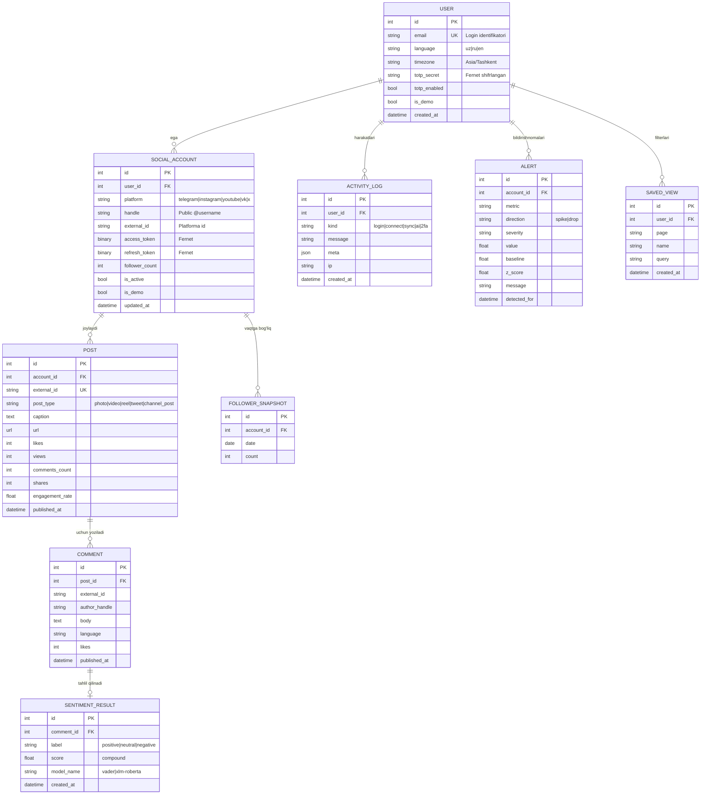
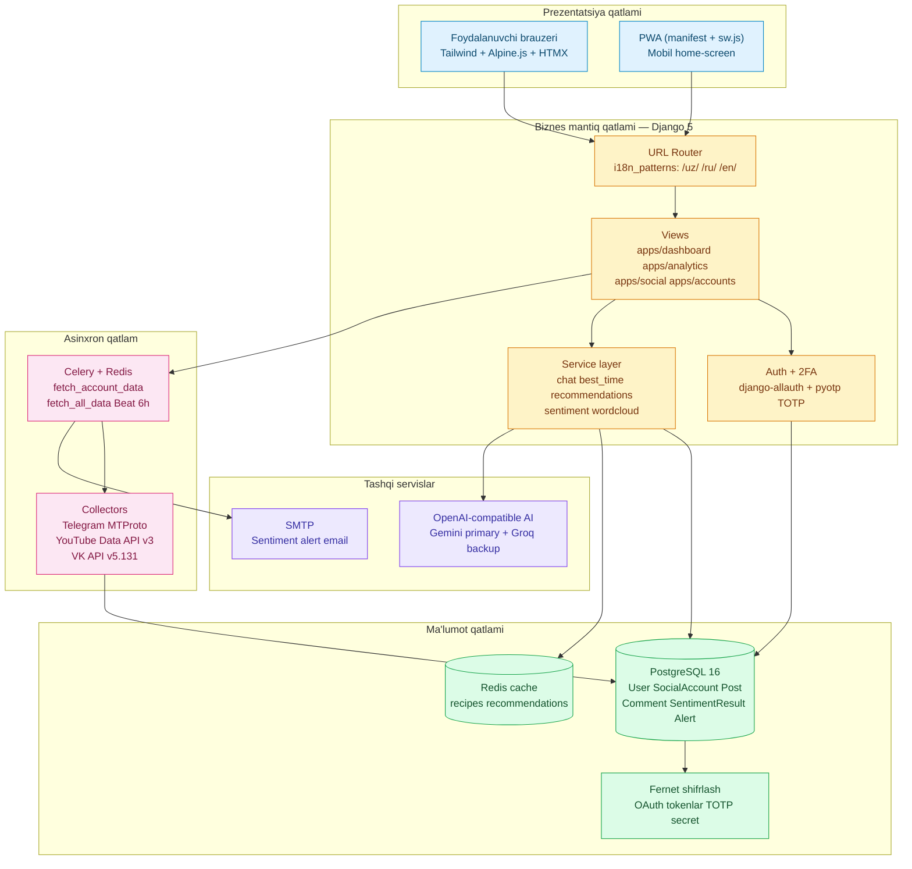
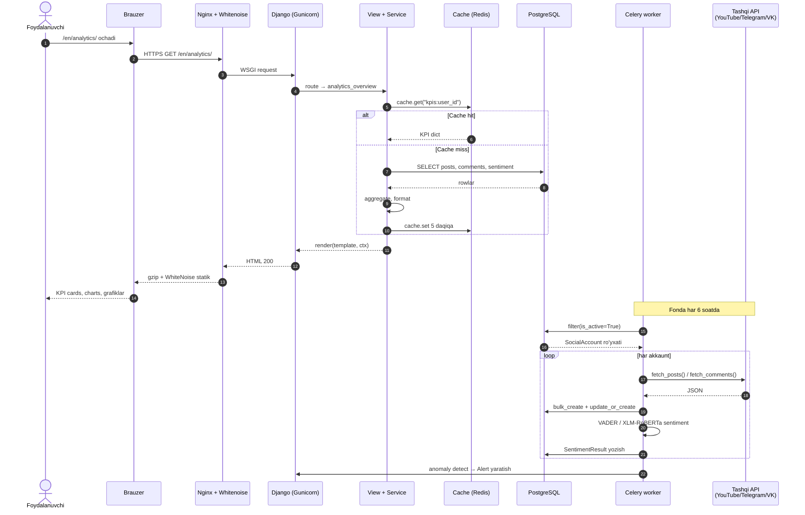
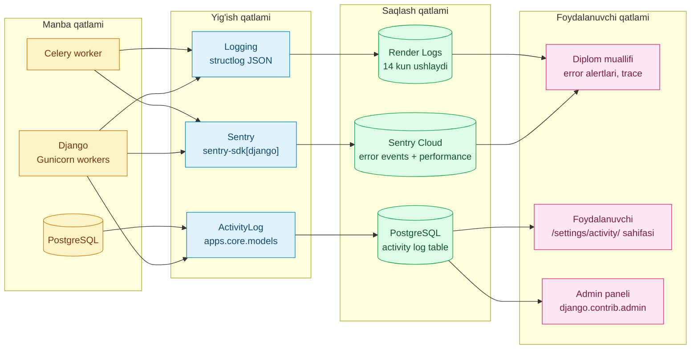

# Loyiha diagrammalari

"Social Analytics" diplom loyihasining texnik diagrammalari. Hammasi
Mermaid sintaksida yozilgan — GitHub bu blokni avtomatik render qiladi
va loyihaning Word hujjatiga PNG sifatida qo'shilgan.

Mermaid manba fayllar (`*.mmd`) shu papkada saqlanadi va PNG/SVG
ko'rinishlari `mermaid.ink` orqali render qilinadi.

---

## 2.4-rasm. Ma'lumotlar bazasi sxemasi (ER-diagram)

Foydalanuvchi → Akkaunt → Post → Komment → Sentiment zanjirini
ko'rsatadi. Asosiy entity'lar va ular orasidagi munosabatlar
(one-to-many, optional) Crow's-foot belgilashida tasvirlangan.

---

## 2.5-rasm. Tizim arxitekturasi (4-qatlamli + DDD apps)

To'rt qatlamli yondashuv: prezentatsiya → biznes mantiq → asinxron task
queue → ma'lumot. Tashqi servislar (AI, SMTP) alohida qatlamda
ko'rsatilgan. Har bir Django app o'z chegarasiga ega (Domain-Driven
Design).

---

## 2.7-rasm. Ma'lumot oqimi — foydalanuvchi so'rovidan natijagacha

Sequence diagrammada ikkita oqim ko'rsatiladi:
- **Foydalanuvchi so'rovi**: brauzerdan analytics sahifasini yuklash
  jarayoni, cache → DB → render zanjiri.
- **Fonda yig'ish**: Celery Beat har 6 soatda barcha akkauntlarni sync
  qiladi va sentiment tahlilini ishga tushiradi.

---

## 2.8-rasm. Monitoring va observability arxitekturasi

Uch darajali yondashuv: manba (app/worker/db) → yig'ish (logger,
Sentry, ActivityLog) → saqlash (Render Logs, Sentry Cloud, PostgreSQL)
→ foydalanuvchi (developer alertlari, foydalanuvchi tarixi sahifasi,
admin paneli).

