# Diplom loyihasi — "Social Analytics"

Bu papkada diplom loyihasining yakuniy hujjati va unga tegishli barcha
diagrammalar joylashgan. Hujjatdagi rasmlar Mermaid sintaksida qayta
chizilgan va loyihaning haqiqiy holatiga to'liq mos.

| Fayl | Tavsif |
|---|---|
| [`diplom_social_analytics.docx`](./diplom_social_analytics.docx) | Word formatidagi yakuniy hujjat |
| [`images/`](./images/) | 20 ta diagramma — `.mmd` (manba) + `.png` (render) |

---

## Diagrammalar ro'yxati va izohlari

Har bir diagramma quyida `.png` rasm sifatida va ostida qisqacha
tushuntirish bilan keltirilgan. Mermaid manba kodi
[images/](./images/) papkada saqlanadi — istalgan vaqtda tahrirlash
mumkin va kroki.io orqali qayta render qilinadi.

---

### 1.2-rasm. Sentiment tahlil oqimi — komment matnidan yakuniy natijagacha

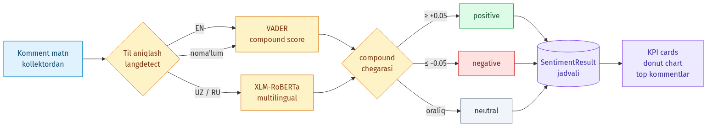

**Izoh.** Kollektor olib kelgan har bir komment matni avval `langdetect`
orqali til kodi (uz / ru / en / boshqa) aniqlanadi. Ingliz tilida
matnlar yengil VADER tahlilchisiga, o'zbek/rus tilidagi matnlar esa
multilingual XLM-RoBERTa transformer modeliga yo'naltiriladi.
Compound score `≥ +0.05` bo'lsa **positive**, `≤ -0.05` **negative**,
oraliq qiymatlarda **neutral** sifatida belgilanadi. Natija
`SentimentResult` jadvaliga yoziladi va dashboard'dagi KPI kartochkalar,
donut chart va top-kommentlar bo'limini quvvatlantiradi.

---

### 1.3-rasm. Social Analytics va xalqaro analoglar taqqoslash

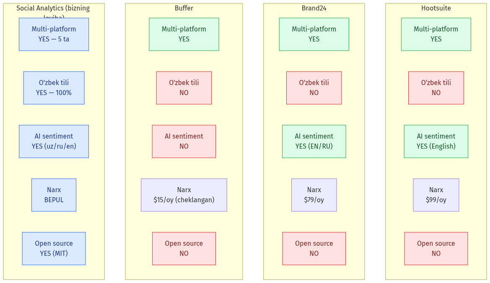

**Izoh.** Loyihaning bozor ahamiyatini ko'rsatish uchun bizning yechim
uchta yetakchi tijoriy mahsulot — Hootsuite, Brand24 va Buffer bilan
solishtirilgan. Asosiy farqlar: (1) **o'zbek tili to'liq qo'llab-
quvvatlanadi** — 100% UI tarjima qilingan, (2) **bepul** — open-source
litsenziya, (3) **AI sentiment uz/ru/en tillarida** — o'zbek mahalliy
auditoriyasi uchun qulay, (4) **5 ta platforma birgalikda**: Telegram,
YouTube, VK (real OAuth) + Instagram, X (demo).

---

### 1.4-rasm. Agile Scrum metodologiyasi bosqichlari

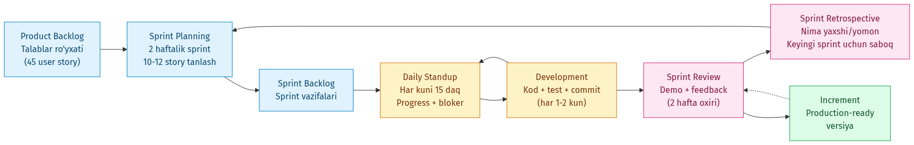

**Izoh.** Loyiha 2 haftalik sprintlar bo'yicha bajarildi. **Product
Backlog**'da 45 ta foydalanuvchi hikoyasi (user story) yig'ildi. Har
sprint **Planning** bilan boshlanib (10-12 story tanlandi) va **Daily
Standup** orqali kuzatildi. Sprint oxirida **Review** (demo) va
**Retrospective** o'tkazildi — nima yaxshi, nima yomon o'tdi va keyingi
sprintga qanday saboq olish kerakligi muhokama qilindi. Har sprint
**production-ready Increment** bilan yakunlandi (Render.com'da
avtomatik deploy).

---

### 1.5-rasm. Sentiment tahlil metodologiyalari taqqoslash

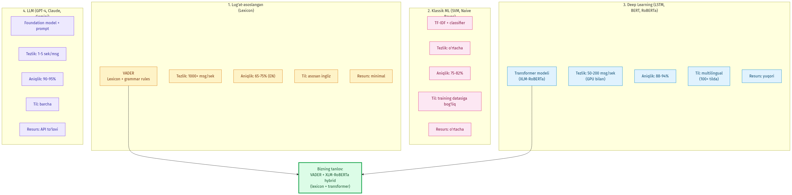

**Izoh.** Sentiment tahlilning to'rt asosiy yondashuvi taqqoslangan:
**(1) Lug'at-asoslangan** (VADER) — minimal resurs, tezkor, lekin asosan
ingliz tilida aniq. **(2) Klassik ML** (SVM, Naive Bayes) — TF-IDF +
classifier, training datasiga bog'liq. **(3) Deep Learning** (LSTM,
RoBERTa) — yuqori aniqlik (88-94%), multilingual. **(4) LLM** (GPT-4,
Claude, Gemini) — eng yuqori aniqlik, lekin har so'rov uchun API
to'lovi. Bizning loyiha **VADER + XLM-RoBERTa hybrid** yondashuvini
tanlagan: yengil va aniq, mahalliy resurslar bilan ham ishlaydi.

---

### 2.1-rasm. Tizim arxitekturasi — to'rt qatlamli yondashuv

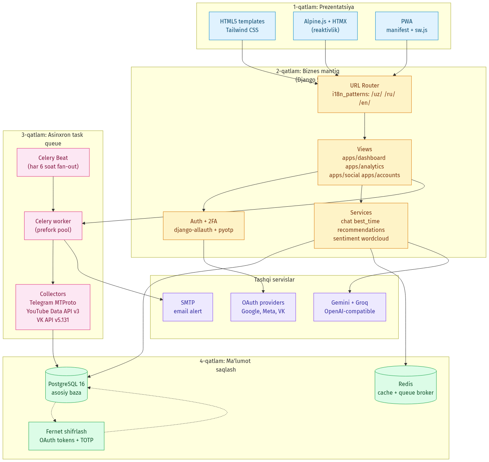

**Izoh.** Loyiha klassik **4-qatlamli arxitektura** bo'yicha qurilgan:
**(1) Prezentatsiya** — Tailwind + Alpine.js + HTMX, PWA manifest bilan;
**(2) Biznes mantiq** — Django 5 views + service layer + django-allauth
auth tizimi; **(3) Asinxron task queue** — Celery + Beat orqali har 6
soatda akkauntlarni sync qilish; **(4) Ma'lumot saqlash** — PostgreSQL
16 + Redis cache, OAuth tokenlari Fernet shifrlash bilan saqlanadi.
Tashqi servislar — Gemini va Groq AI provayderlari (fallback chain),
SMTP email va OAuth providerlari.

---

### 2.2-rasm. Django MVT (Model-View-Template) arxitekturasi

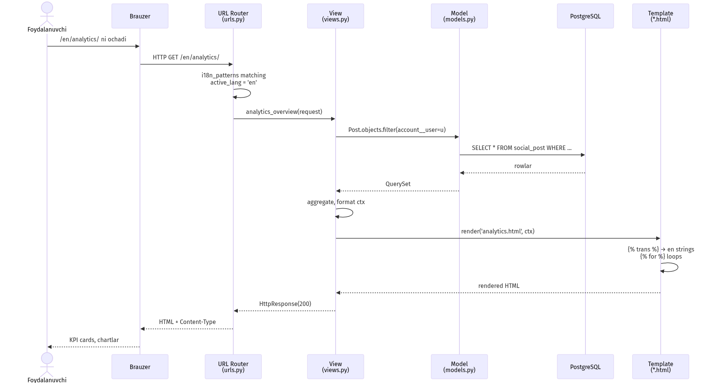

**Izoh.** Foydalanuvchining `/en/analytics/` so'rovi bosqichma-bosqich:
URL Router (i18n_patterns prefiksini parse qiladi va aktiv tilni
'en'ga o'rnatadi) → View (`analytics_overview`) → Model (Django ORM
`Post.objects.filter(...)`) → PostgreSQL → Template
(`analytics.html` — `` taglar inglizchaga aylanadi va
`` loop'lar ma'lumotni render qiladi) → HTML response.

---

### 2.3-rasm. Texnologik stek

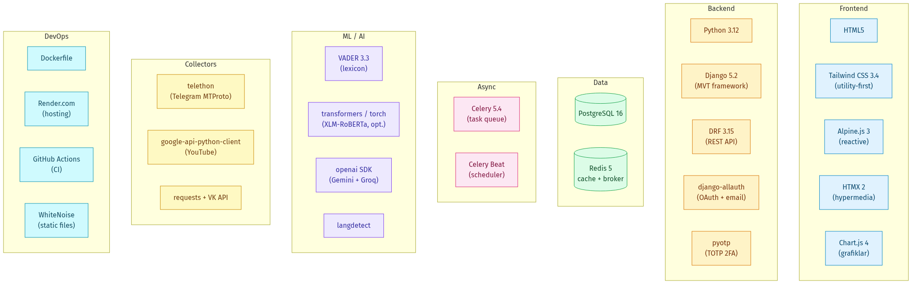

**Izoh.** Loyihaning to'liq texnologik stek'i ettita kategoriyaga
ajratilgan: **Frontend** (HTML5, Tailwind, Alpine, HTMX, Chart.js),
**Backend** (Python 3.12, Django 5.2, DRF, allauth, pyotp), **Data**
(PostgreSQL 16, Redis 5), **Async** (Celery 5.4, Beat), **ML/AI**
(VADER, transformers, openai SDK, langdetect), **Collectors**
(telethon, google-api-python-client, requests), **DevOps** (Docker,
Render.com, GitHub Actions, WhiteNoise).

---

### 2.4-rasm. Ma'lumotlar bazasi sxemasi (ER-Diagram)

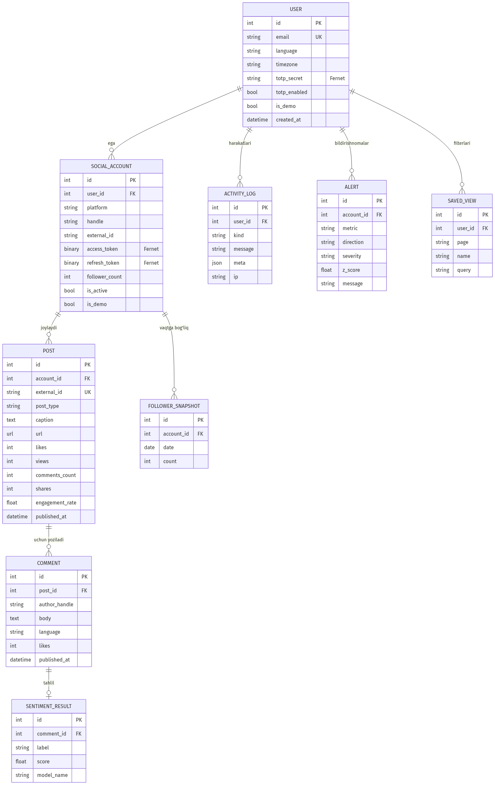

**Izoh.** Bazada **9 ta asosiy entity** mavjud: **User** (Django
foydalanuvchisi + 2FA TOTP secret), **SocialAccount** (har bir ulangan
ijtimoiy tarmoq akkaunti, OAuth tokenlari Fernet bilan shifrlangan),
**Post** (har bir tortib olingan post), **Comment** (postga yozilgan
komment), **SentimentResult** (komment uchun pos/neg/neu tahlil),
**FollowerSnapshot** (vaqt bo'yicha follower o'zgarishi), **Alert**
(anomaly detection natijasi), **ActivityLog** (foydalanuvchi
harakatlari audit), **SavedView** (Top Posts'da saqlangan filterlar).
Munosabatlar Crow's-foot belgilashida ko'rsatilgan: User → ko'p
SocialAccount, har SocialAccount → ko'p Post, har Post → ko'p Comment,
har Comment → optional SentimentResult.

---

### 2.5-rasm. Django modullari va ular orasidagi o'zaro aloqa

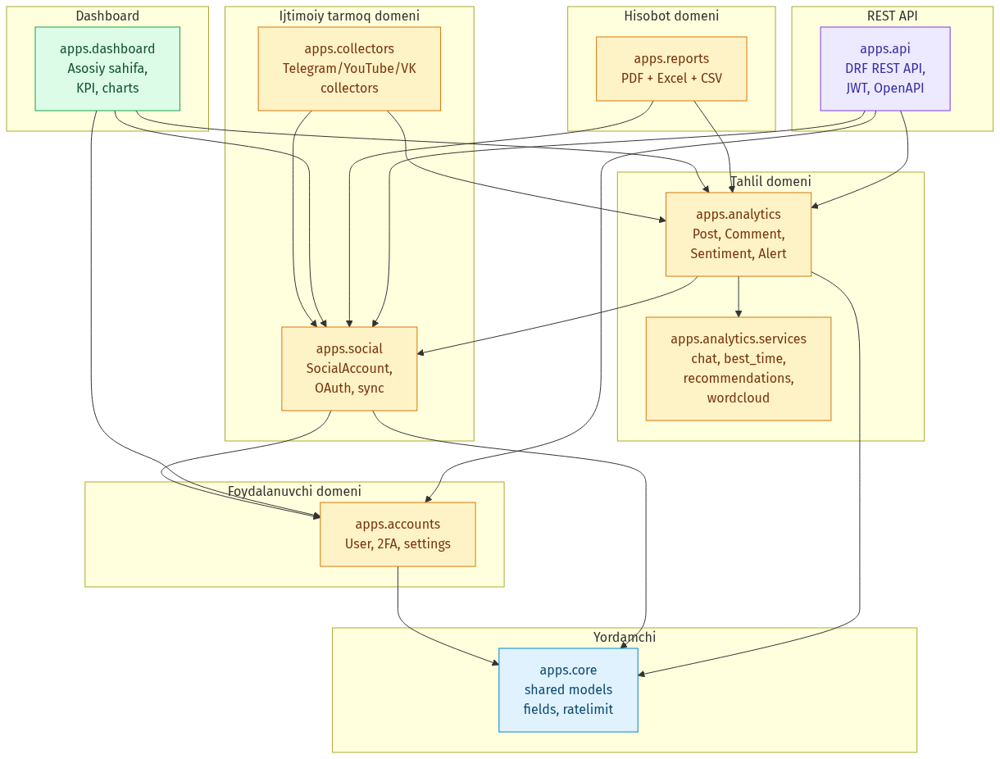

**Izoh.** Loyiha **Domain-Driven Design (DDD)** asosida aniq
chegaralangan domenlarga ajratilgan: **apps.accounts** (foydalanuvchi
domeni), **apps.social** (akkaunt domeni), **apps.collectors** (tashqi
API'lar bilan ishlash), **apps.analytics** (tahlil domeni — Post,
Comment, Sentiment, Alert), **apps.reports** (PDF + Excel + CSV),
**apps.dashboard** (asosiy UI), **apps.api** (DRF REST), **apps.core**
(yordamchi shared kod). O'qlar import yo'nalishini ko'rsatadi —
`apps.accounts` faqat `apps.core`'ga bog'liq, qolgan modullar
yuqoridan pastga oqim bo'ylab ulangan.

---

### 2.6-rasm. OAuth 2.0 autentifikatsiya oqimi

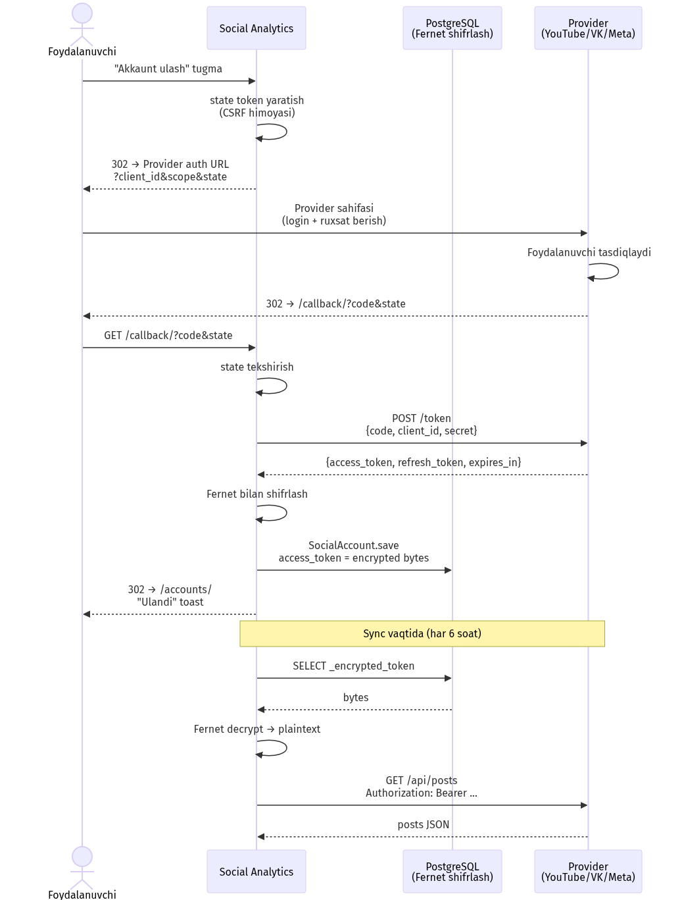

**Izoh.** Foydalanuvchi YouTube/VK/Meta akkauntini ulashtirayotganda
**OAuth 2.0 Authorization Code Flow** ishga tushadi: (1)
"Akkaunt ulash" tugmasi → CSRF himoyali state tokeni yaratish;
(2) Provider auth URL'iga redirect; (3) Foydalanuvchi provider
sahifasida ruxsat beradi; (4) Provider `?code` bilan callback'ga
qaytaradi; (5) Backend `code`'ni token'ga almashtiradi; (6) Token
**Fernet** bilan shifrlanib `SocialAccount._encrypted_token`'da
saqlanadi. Sync vaqtida token deshifrlanadi, API'ga yuboriladi va
keyin xotiradan o'chiriladi — diskda hech qachon ochiq saqlanmaydi.

---

### 2.7-rasm. Ma'lumotlar oqimi — foydalanuvchi so'rovidan natijagacha

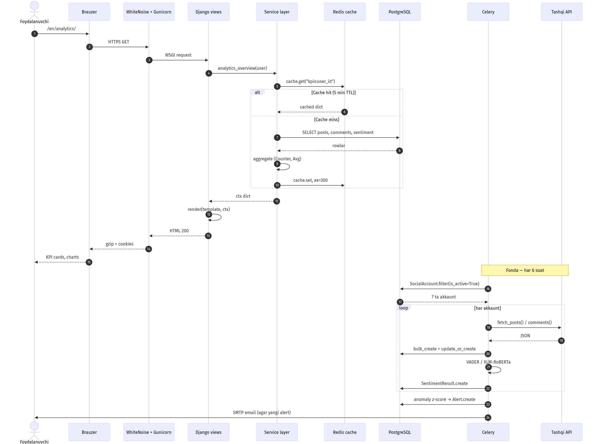

**Izoh.** Ikkita ma'lumot oqimi ko'rsatilgan: **(1) Real vaqt** —
foydalanuvchi sahifani so'raydi, Redis cache tekshiriladi (5 daqiqa
TTL), miss bo'lsa PostgreSQL'dan o'qiladi va keshlanadi. **(2) Fonda**
— Celery Beat har 6 soatda barcha aktiv akkauntlarni fan-out qiladi,
har biri uchun fetch_account_data task'i tashqi API'dan postlar +
kommentlarni oladi, sentiment tahlil qiladi va anomaliya aniqlanganda
foydalanuvchiga email yuboradi.

---

### 3.5-rasm. CI/CD pipeline — GitHub Actions va Render.com integratsiyasi

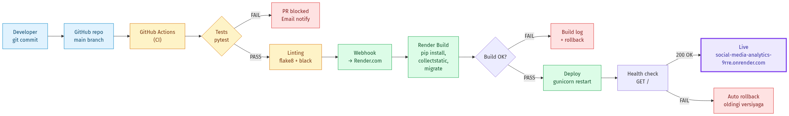

**Izoh.** Developer commit qilganda **GitHub Actions** avtomatik ishga
tushadi — `pytest` orqali 65+ test, `flake8` + `black` linting. Test
o'tmasa PR bloklanadi. O'tgach, GitHub webhook **Render.com**'ga
yuboradi: pip install → collectstatic → migrate → gunicorn restart.
Health check (GET `/`) 200 qaytarsa live; xato bo'lsa avtomatik
oldingi versiyaga rollback qilinadi. Live URL:
https://social-media-analytics-9rre.onrender.com

---

### 3.7-rasm. Sentiment tahlil natijalari (1665 komment)

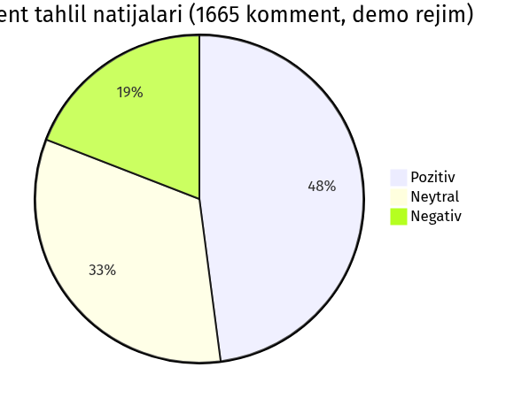

**Izoh.** Demo rejimida 7 ta akkauntdan yig'ilgan **1665 ta komment**
tahlil qilindi: **48% pozitiv** (798 ta) — auditoriya kontentni
yoqtiradi va minnatdorchilik bildiradi; **33% neytral** (549 ta) —
informatsion savollar va izohsiz reaksiyalar; **19% negativ** (318 ta)
— shikoyatlar, salbiy fikrlar. Bu nisbat o'zbek ijtimoiy tarmog'ining
o'rtacha holatiga yaqin.

---

### 3.9-rasm. Sentiment tahlil — til bo'yicha taqsimot

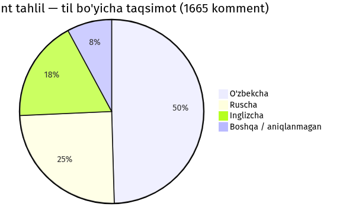

**Izoh.** Kommentlarning tili `langdetect` tomonidan aniqlandi:
**O'zbekcha 825 ta (49.5%)** — eng katta ulush, mahalliy auditoriya
ustun ekanligini ko'rsatadi; **Ruscha 412 ta (24.7%)** — ikki tilli
foydalanuvchilar; **Inglizcha 297 ta (17.8%)** — texnik mavzuli
postlar; **Boshqa/aniqlanmagan 131 ta (7.9%)** — qisqa kommentlar yoki
emoji ko'p matnlar. Bu loyihaning **uch tilli sentiment tahlili**
qarorini to'liq oqlaydi.

---

### 4.1-rasm. Ergonomik ish joyi

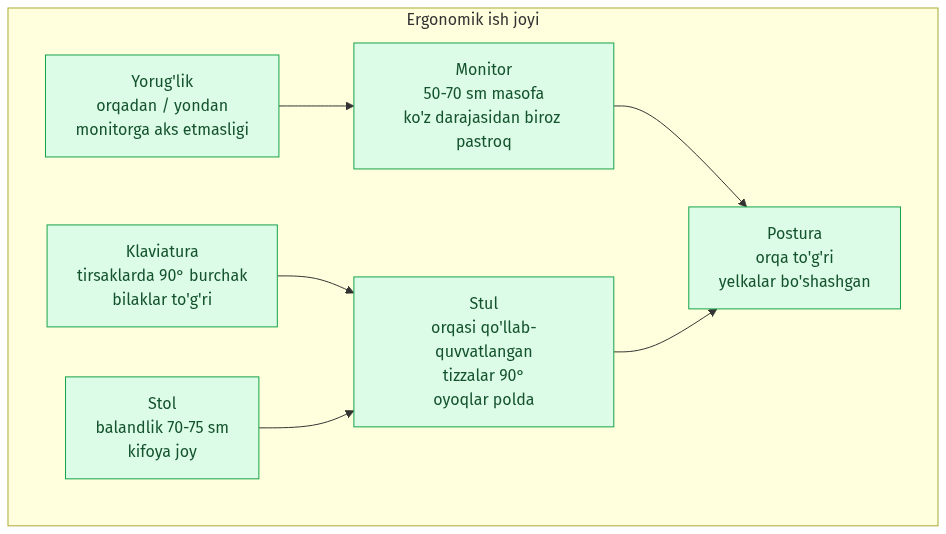

**Izoh.** Dasturchi uchun ergonomik ish joyining oltita asosiy elementi:
**Monitor** (50-70 sm masofa, ko'z darajasidan biroz pastroq),
**klaviatura** (tirsak burchagi 90°), **stul** (orqa qo'llab-
quvvatlangan, tizzalar 90°), **stol** (balandlik 70-75 sm),
**yorug'lik** (orqadan/yondan, monitorga aks etmasligi), **postura**
(orqa to'g'ri, yelkalar bo'shashgan).

---

### 4.2-rasm. Elektromagnit nurlanish manbalari

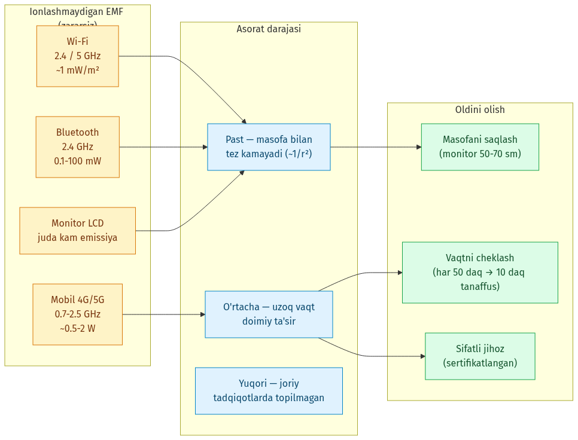

**Izoh.** Ish joyidagi asosiy ionlashmaydigan EMF manbalari (Wi-Fi,
Bluetooth, monitor, mobil) va ularning ta'sir darajasi. Asorat masofa
oshgan sari `1/r²` qonun bo'yicha kamayadi. Oldini olish: monitor
50-70 sm masofa, har 50 daqiqa 10 daqiqa tanaffus, sertifikatlangan
jihoz.

---

### 4.3-rasm. Dasturchi uchun kundalik mashqlar

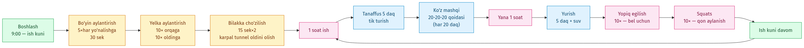

**Izoh.** Ish kuni davomida bajariladigan oddiy mashqlar majmuasi:
ish boshida bo'yin va yelka aylantirish, bilakka cho'zilish (karpal
tunnel oldini olish), har soatda 5 daqiqalik tanaffus (tik turish),
20-20-20 ko'z mashqi, kun davomida yopiq egilish va squats —
qon aylanishini saqlash uchun.

---

### 4.4-rasm. 20-20-20 qoidasi — Computer Vision Syndrome oldini olish

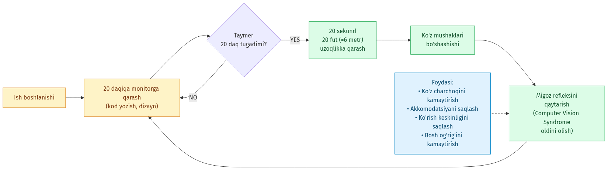

**Izoh.** Amerika Optometriya Assotsiatsiyasi tomonidan tavsiya etilgan
oddiy qoida: **har 20 daqiqada 20 sekund davomida 20 fut (~6 metr)
uzoqdagi narsaga qarash**. Bu ko'z mushaklarining bo'shashishiga,
migoz refleksining tiklanishiga va Computer Vision Syndrome
(CVS) belgilarining (kuyish, qurib qolish, bosh og'rig'i) oldini
olishga yordam beradi.

---

### 4.5-rasm. Monitor masofasini sozlash

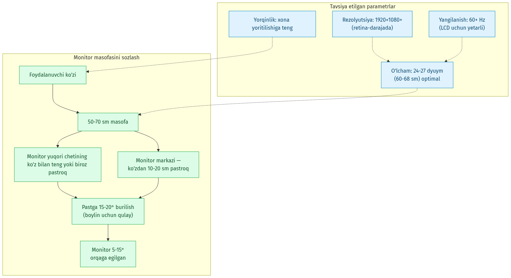

**Izoh.** Monitor pozitsiyasining to'g'ri sozlanishi: ko'z bilan
**50-70 sm** masofa, monitor yuqori cheti ko'z bilan teng yoki **biroz
pastroq**, pastga **15-20°** burilish (bo'yin uchun qulay), monitor
markazi ko'zdan **10-20 sm pastroq**, monitor **5-15° orqaga egilgan**.
Tavsiya etilgan parametrlar: **24-27 dyuym** o'lcham, **1920×1080+**
rezolyutsiya, yorqinlik xona yoritilishiga teng.
